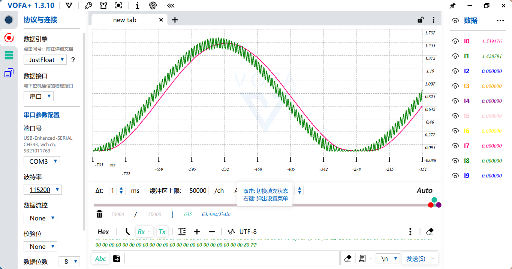

## 滤波器设计

> stm32 HAL 库下，实现多种滤波器的整合对比。
> 这是我上完数字信号处理后的一些想法，感觉理论可以同实践结合起来。本质上也是发现没有合适的教程入门滤波器，书本过于强调原理，但仿真终究是仿真。因此我开这样一个坑，帮助想要学习滤波器的同学。
> 希望大家要多多究其原理，这样才能学到更多的知识。

### 环境
- stm32 f103c8t6
- stm32f407vet6

### 滤波效果


### 任务目标

- [x] 单片机ADC采集电压作为数据
- [x] DAC实现多种信号发生器
- [ ] 频谱分析
	- [ ] fft 代码实现
	- [ ] fft 可视化
- [ ] 滤波器设计
	- [ ] IIR 常见滤波器
		- [ ] Butterworth
		- [ ] Chebyshev 1/2
		- [ ] ellipse
		- [ ] 有限长序列信号卷积
		- [ ] 常用的低通滤波器，原理推导
	- [ ] FIR 常见滤波器
		- [ ] 窗函数法确定h(n)
		- [ ] 频率变换法确定h(n)
		- [ ] 无限长序列同有限长信号卷积实现
- [ ] 现代滤波器
	- [ ] 卡尔曼滤波器设计
		- [ ] 一阶
		- [ ] 二阶
		- [ ] 扩展卡尔曼滤波 EKF
		- [ ] 无迹卡尔曼滤波 UKF
	- [ ] 自适应滤波器
	- [ ] 短时傅里叶变换 SMFT
	- [ ] 小波变换法
	- [ ] 机器学习法

### 文件分布

```
- Demo_led 测试版 目前存放了卷积和Butterworth低通滤波  
- signalGenerate 信号发生器 没有做正弦信号 一些频率可能有误差
```

### 研究进程
- 2025-11-11 在我新写的梯形波发生器上，发现梯形波的周期在1hz下，单边斜率取10%，
	 是是否产生吉布斯效应的临界值。
- 2025-11-30 暂时搁置，另外有可能Demo_led八阶巴特沃斯滤波器中滤除阶跃信号的震荡波形可能是零阶保持特性，不是吉布斯效应？